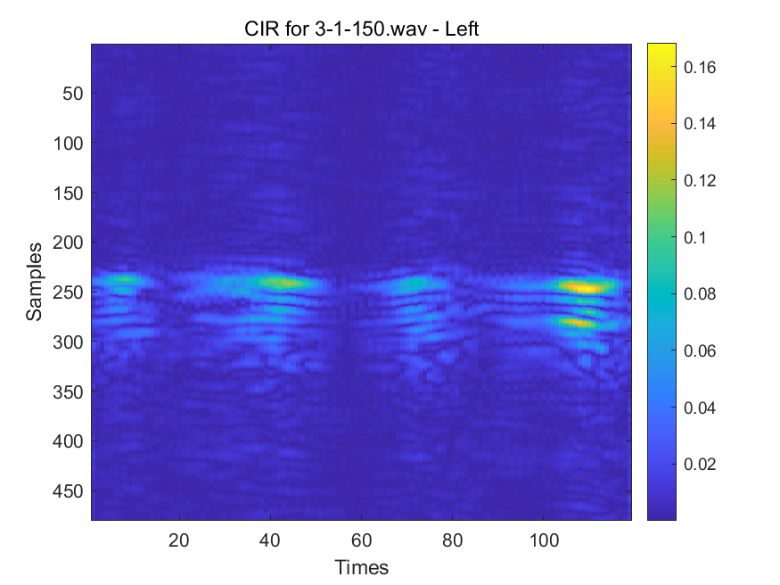
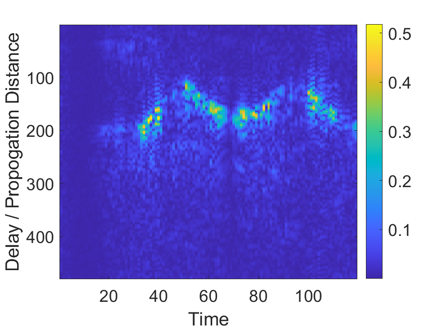

# MoGL Acoustic Sensing Dataset
Due to the large number of files, we have placed the data on Google Drive.
```
https://drive.google.com/drive/folders/1FhmzA6DJKI71GT4vyyUnKfzrq_TWy2RN
```

The MoGL dataset contains acoustic sensing data collected for robust multi-view learning and unsupervised acoustic sensing research. The dataset is designed to support multiple acoustic sensing tasks, including digit writing recognition, gesture recognition, and writer identification.

The data are collected using active acoustic sensing. During data collection, a speaker emits predefined acoustic probing signals, while microphones receive the reflected signals caused by human hand or limb movements. The received acoustic signals are then processed into Channel Impulse Response (CIR) representations, which capture the spatial-temporal reflection patterns of different human activities.

## 📦 Content

- **Data modality:** Channel Impulse Response (CIR)
- **Digit classes:** 0–9
- **Gesture classes:** push & pull, slide, swipe, clap, zigzag, circle
- **Data format:** .mat
- **File naming rule:** `a-b-c`
  - `a`: Digit or Gesture category
  - `b`: Writer ID
  - `c`: Sample count

## 🔍 Examples

### Digit Example

Digit writing sample:



Example filename:

`3-1-150.png`

where:

`3` denotes the digit category, `1` denotes the writer ID, and `150` denotes the sample count.

### Gesture Example

Gesture recognition sample:



Example filename:

`12-1-100.png`

where:

`14` denotes the gesture category, `1` denotes the writer ID, and `100` denotes the sample count.

## 🗂️ File Structure

The dataset is organized by task and class labels.

```bash
- /
  ├── /digits
  │   ├── /0
  │   │   ├── 0-1-1.png
  │   │   ├── 0-1-2.png
  │   │   ├── 0-2-1.png
  │   │   └── ...
  │   ├── /1
  │   │   ├── 1-1-1.png
  │   │   ├── 1-2-1.png
  │   │   └── ...
  │   ├── /2
  │   │   └── ...
  │   └── ...
  │
  └── /gestures
      ├── /10(push & pull)
      │   ├── 10-1-1.png
      │   ├── 10-2-1.png
      │   └── ...
      ├── /11(slide)
      │   ├── sweep-1-001.png
      │   └── ...
      ├── /12(clap)
      │   └── ...
      ├── /13(swipe)
      │   └── ...
      ├── /14(zigzag)
      │   └── ...
      └── /15(circle)
          └── ...
  
